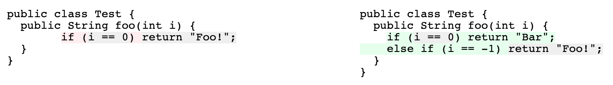

# Gum

Gum is a library to compute differences between ASTs using gum-tree-diff algorithm.

## Usage

API: https://godoc.org/github.com/smacker/gum

```go
import "github.com/smacker/gum"

// list of matched nodes in both trees
mapping := gum.Match(srcTree, dstTree)
// list of actions to transform srcTree to dstTree
actions := gum.Patch(srcTree, dstTree, mapping)
```

## Parsers

### Bblfsh

The library provides basic integration with bblfsh.

### Golang

The library contains incomplete integration with native Go parser.

### Custom

Any other parser can be used but would require transformation into `gum.Tree`:

```go
t := &gum.Tree{
    Type:     "string", // type of a node
    Value:    "string", // value/token/label of a node
    Children: []*gum.Tree{}, // list of children
    Meta:     n, // optional pointer to the original node
}

t.Refresh() // update internal state of the tree
```

## Cli

To explore how library works use built-in command line interface.

Nodes matching:
```
gum match srcFile dstFile
```

Patch generation:
```
gum diff srcFile dstFile
```

Highlighted diff:
```
gum webdiff srcFile dstFile
```



## Developement

### Testing

(Optional) Get and prepare samples to compare results with reference implementation:

```bash
git submodule update
JAVA_GUM_BIN=/path/to/gumtree-2.1.2/bin ./testdata/process_samples.sh
```

Run the tests:

```bash
go test -v ./...
```

## Credits

- Based on the paper [Fine-grained and Accurate Source Code Differencing](https://hal.archives-ouvertes.fr/hal-01054552/document) by Jean-Rémy Falleri, Floréal Morandat, Xavier Blanc, Matias Martinez and Martin Monperrus.
- And reference java implementation [GumTreeDiff/gumtree](https://github.com/GumTreeDiff/gumtree).
